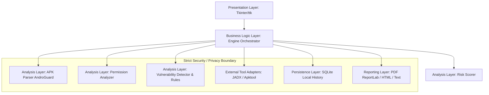

# System Architecture: Mobile Data Leak Detector

## 1. Executive Overview & Paradigm
The **Mobile Data Leak Detector** is an academic research prototype desktop application engineered to audit Android APK packages for potential privacy and data leakage risks.

### Core Paradigm: Strictly Static Analysis
The tool operates under a strict **static-only analysis model**:
- **Zero Runtime Execution**: APK files are never installed or run in an emulator or on physical devices.
- **Static Indicators**: Identified endpoints, API calls, and credentials are classified strictly as *static risk indicators*, not proof of runtime data transmission.
- **Zero Remote Exfiltration**: The system executes completely offline; no analysis telemetry or APK bytecode is uploaded to external endpoints.
- **Privacy by Design**: Plaintext extraction secrets are redacted in logs and sanitized in generated reports.

---

## 2. Multi-Layered Architecture

### 2.1 Presentation Layer (`src/data_leak_detector/ui/`)
Built with standard Python Tkinter and `ttk` to guarantee cross-platform availability without heavyweight web-engine overhead:
- `MainWindow`: Manages lifecycle, responsive layout, and navigation tabs.
- `AnalyzeView`: File selection (file dialog/browse), APK metadata summary, and scan initiation.
- `ResultsView`: Tabular and hierarchical treeviews of findings, severity breakdown, and report generation controls.
- `HistoryView`: Query interface for viewing historical local scans persisted in SQLite.
- `SettingsView`: Subprocess timeouts, tool detection status (`jadx`, `apktool`), and rule threshold settings.
- `widgets.py`: Reusable, accessible widgets (e.g., `SeverityBadge`, metric gauge cards).

### 2.2 Business Logic Layer (`src/data_leak_detector/core/` & `engine.py`)
- Coordinates the complete analysis workflow from raw APK input to structured `AnalysisResult`.
- Dispatches status events and progress notifications asynchronously to the UI via thread-safe callbacks.
- Enforces execution timeouts and lifecycle management.

### 2.3 Analysis Modules (`src/data_leak_detector/analysis/` & `rules/`)
- **`APKParser`**: Employs AndroGuard to unpack `AndroidManifest.xml`, decode DEX bytecode, and extract string literals, resources, and method references.
- **`PermissionAnalyzer`**: Compares declared and requested Android permissions against `resources/permission_metadata.json` to flag dangerous, signature-level, or exfiltration-enabling permission combinations (e.g., `READ_PHONE_STATE` + `INTERNET`).
- **`VulnerabilityDetector` & Rule Sets (`src/data_leak_detector/rules/`)**:
  - `manifest_rules.py`: Insecure manifest configurations (`android:allowBackup=true`, `android:debuggable=true`).
  - `network_rules.py`: Static cleartext transmission indicators (HTTP endpoints, cleartext traffic permits).
  - `secret_rules.py`: Static API keys and secrets matching regex signatures (AWS, Google, cloud tokens).
  - `storage_rules.py`: Insecure storage patterns (world-readable flags, unprotected external storage).
  - `crypto_rules.py`: Broken or deprecated crypto primitives (ECB mode, DES, MD5, hardcoded IVs).
  - `sdk_rules.py`: Signatures for third-party tracking, ad, and attribution SDKs.
- **`RiskScorer`**: Normalizes finding counts and severities into a weighted risk score (0.0 to 100.0) with categorical grades (INFO, LOW, MEDIUM, HIGH, CRITICAL).

### 2.4 External-Tool Adapters (`src/data_leak_detector/analysis/tool_adapters.py`)
- Wraps optional external tools (`jadx` for Java source decompilation, `apktool` for resource decoding).
- **Graceful Degradation**: If an external binary is absent on system PATH, analysis seamlessly falls back to AndroGuard's built-in DEX parsing.
- **Subprocess Safety**:
  - `shell=True` is strictly prohibited.
  - Strict execution timeouts (default 120s) with automated process tree termination.
  - Temporary workspace cleanup via Python context managers.

### 2.5 Persistence Layer (`src/data_leak_detector/storage/database.py`)
- Local SQLite database (`analysis_history.sqlite3`) storing metadata, aggregated scores, and finding references.
- Enables historical comparison and audit logs without remote transmission.

### 2.6 Reporting Layer (`src/data_leak_detector/reporting/`)
- Formats `AnalysisResult` data into formal academic audit documents:
  - `pdf_report.py`: High-fidelity PDF report generation using ReportLab.
  - `html_report.py`: Self-contained interactive HTML document.
  - `text_report.py`: Plaintext / Markdown summary for CLI or terminal inspection.
- All report generators automatically sanitize and redact detected secrets.

---

## 3. Data Flow Architecture

1. **User Input**: User selects a valid `.apk` file via `AnalyzeView`.
2. **Metadata Extraction**: `APKParser` calculates SHA-256 hash, file size, package name, and SDK version limits.
3. **Manifest & Permission Audit**: Permissions are extracted and audited against privacy risk baselines.
4. **Bytecode Analysis**: String pools, DEX class hierarchies, and method call sites are extracted.
5. **Rule Evaluation**: Pluggable static rules evaluate the extracted artifacts against known indicators.
6. **Risk Calculation**: `RiskScorer` tallies weighted findings into an overall risk rating.
7. **Persistence**: `DatabaseManager` records the scan run in local SQLite.
8. **UI Presentation & Export**: Results are rendered in `ResultsView` with one-click export to PDF/HTML/Text.

---

## 4. Security & Privacy Boundaries

| Boundary Principle | Implementation Mechanism |
| :--- | :--- |
| **No Dynamic Execution** | No invocation of `adb install`, Android emulators, or runtime code loaders. APKs are treated solely as archive files. |
| **Offline Privacy** | No socket connections to remote servers for telemetry or analytics. All databases and resources are local. |
| **Secret Redaction** | `SensitiveDataFilter` masks credentials in logs; report formatters redact tokens by default. |
| **Subprocess Isolation** | External tools are invoked using explicit argument vectors (lists), omitting `shell=True`, and bound by strict timeouts. |
| **Sandbox Cleanup** | Temporary decompiled files are stored in `temp_decompiled/` and cleaned up upon analysis completion. |

---

## 5. Requirement Traceability Matrix

### Functional Requirements (FR)
- **FR-01: APK Analysis**: Static unpacking and parsing of APK package structures, Android manifest, and compiled DEX bytecode using AndroGuard.
  - *Traceability*: `data_leak_detector.analysis.apk_parser`, `data_leak_detector.analysis.engine`
- **FR-02: Permission Auditing**: Comprehensive categorization of declared permissions and identification of dangerous or high-risk capability clusters.
  - *Traceability*: `data_leak_detector.analysis.permission_analyzer`, `resources/permission_metadata.json`
- **FR-03: Data-Leak Indicator Detection**: Identification of static indicators that suggest potential data exfiltration (e.g. unencrypted endpoints, tracking SDKs).
  - *Traceability*: `data_leak_detector.rules.network_rules`, `data_leak_detector.rules.sdk_rules`, `resources/tracking_patterns.json`
- **FR-04: Vulnerability Identification**: Rule-based detection of insecure manifest flags, hardcoded secrets, weak cryptographic primitives, and insecure storage access.
  - *Traceability*: `data_leak_detector.rules.*`, `data_leak_detector.analysis.vulnerability_detector`
- **FR-05: Report Generation**: Generation of exportable audit reports in PDF (ReportLab), HTML, and plain text formats.
  - *Traceability*: `data_leak_detector.reporting.*`

### Non-Functional Requirements (NFR)
- **NFR-01: Usability**: Clean, accessible desktop graphical interface in Tkinter/ttk with progress reporting, responsive UI, and clear error messaging.
  - *Traceability*: `data_leak_detector.ui.*`
- **NFR-02: Performance**: Bounded memory consumption, asynchronous background analysis threads to prevent UI freezes, and subprocess execution timeouts.
  - *Traceability*: `data_leak_detector.core.config`, `data_leak_detector.analysis.engine`
- **NFR-03: Reliability**: Graceful degradation when external tools (`jadx`, `apktool`) are missing; robust parsing error handling for corrupted APKs.
  - *Traceability*: `data_leak_detector.analysis.tool_adapters`, `data_leak_detector.core.exceptions`
- **NFR-04: Scalability**: Modular, pluggable rule architecture (`BaseRule`) allowing effortless addition of new leak detection rules without altering the core engine.
  - *Traceability*: `data_leak_detector.rules.base`
- **NFR-05: Portability**: Standalone Python 3 application compatible with Windows, Linux, and macOS without requiring system services.
  - *Traceability*: `pathlib.Path` usage, standard library Tkinter and SQLite.
- **NFR-06: Privacy / Security**: 100% local analysis, zero APK execution or external transmission, automated cleanup of decompiled artifacts, and secret redaction.
  - *Traceability*: `data_leak_detector.core.logging_config`, `data_leak_detector.analysis.tool_adapters`
