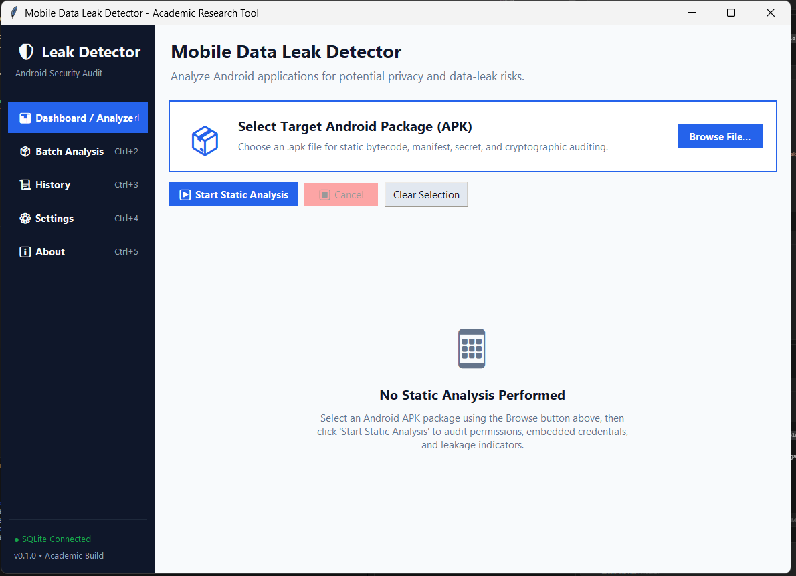

# Mobile Data Leak Detector

[](file:///c:/Users/Iyanu/OneDrive/Desktop/DATA-LEAKAGE-IN-MOBILE-APPS/CHANGELOG.md)
[](file:///c:/Users/Iyanu/OneDrive/Desktop/DATA-LEAKAGE-IN-MOBILE-APPS/pyproject.toml)
[](file:///c:/Users/Iyanu/OneDrive/Desktop/DATA-LEAKAGE-IN-MOBILE-APPS/tests)
[](file:///c:/Users/Iyanu/OneDrive/Desktop/DATA-LEAKAGE-IN-MOBILE-APPS/docs/coverage/index.html)
[](file:///c:/Users/Iyanu/OneDrive/Desktop/DATA-LEAKAGE-IN-MOBILE-APPS/SECURITY.md)

An academic research prototype desktop application for **static-only** detection of potential data leakage risks, security vulnerabilities, and privacy violations in Android applications (APK).

<p align="center">
  
</p>

---

## 🔬 Core Product Constraints & Principles

1. **Strictly Static Analysis**: APK files are treated purely as static archives and bytecode packages. APKs are **never executed, installed, or dynamically loaded**.
2. **Static Indicators, Not Exfiltration Proof**: Network endpoints, URLs, and transmission methods discovered during analysis represent **static risk indicators**, not runtime verification of active data leakage.
3. **100% Offline & Local**: No APK bytecode, metadata, or analysis findings are ever transmitted to external servers. All persistence is managed locally via SQLite.
4. **Subprocess Safety**: External CLI tools (`jadx`, `apktool`) are accessed via safe subprocess wrappers (no `shell=True`, explicit timeouts, graceful degradation if tools are missing). Temporary decompilation artifacts are cleaned up automatically.
5. **Privacy by Design**: Sensitive API keys and credentials detected during scans are automatically redacted in logs and sanitized in reports.

---

## 🏗️ Repository Architecture

```text
mobile-data-leak-detector/
│
├── pyproject.toml                     # PEP 518/621 build configuration and tool settings
├── requirements.txt                   # Production and development dependencies
├── data_leak_detector.spec            # PyInstaller standalone distribution specification
├── README.md                          # Project overview and quickstart guide
├── ARCHITECTURE.md                    # System architecture and data flow specification
├── SECURITY.md                        # Threat model, privacy boundaries, and redaction controls
├── PERFORMANCE.md                     # Profiling methodology, benchmarks, and bottlenecks
├── PACKAGING.md                       # Standalone compilation and distribution guide
├── CHANGELOG.md                       # Project release notes and version history
├── run_app.py                         # Application launch script
│
├── assets/                            # Visual assets and user interface screenshots
│   └── python-image.png               # Desktop dashboard screenshot
│
├── src/
│   └── data_leak_detector/
│       ├── __init__.py                # Package declaration (v0.1.0)
│       ├── app.py                     # Desktop application entry point
│       │
│       ├── core/                      # Domain models, configuration, and logging
│       │   ├── __init__.py
│       │   ├── config.py              # User settings and cross-platform paths
│       │   ├── exceptions.py          # Domain-specific exception hierarchy
│       │   ├── logging_config.py      # Structured rotating file & console logger
│       │   ├── models.py              # Dataclass models (AnalysisResult, SecurityFinding, etc.)
│       │   ├── path_safety.py         # Path traversal & zip-slip sanitation
│       │   └── redactor.py            # API key & credential masking filter
│       │
│       ├── analysis/                  # Static analysis orchestration and parsers
│       │   ├── __init__.py
│       │   ├── apk_parser.py          # AndroGuard APK archive and manifest reader
│       │   ├── batch_processor.py     # Multi-APK sequential processing worker
│       │   ├── engine.py              # Multi-stage static analysis pipeline
│       │   ├── permission_analyzer.py # Android permission categorizer and synergy auditor
│       │   ├── risk_scorer.py         # Weighted 0-100 composite risk scoring algorithm
│       │   ├── tool_adapters.py       # Jadx and Apktool CLI subprocess wrappers
│       │   └── vulnerability_detector.py # Pluggable rule execution engine
│       │
│       ├── rules/                     # 36 Pluggable static vulnerability inspection rules
│       │   ├── __init__.py
│       │   ├── base.py                # Abstract BaseRule interface
│       │   ├── registry.py            # Rule registry and category groupings
│       │   ├── manifest_rules.py      # Debuggable, allowBackup, cleartext traffic rules
│       │   ├── network_rules.py       # Plain HTTP endpoints, trust-all X.509 managers
│       │   ├── secret_rules.py        # Hardcoded Google, AWS, and generic API keys
│       │   ├── storage_rules.py       # World-readable/writeable files, unencrypted storage
│       │   ├── crypto_rules.py        # DES/RC4/ECB broken ciphers, static IVs
│       │   └── sdk_rules.py           # Ad network and tracking SDK pattern identification
│       │
│       ├── reporting/                 # Multi-format report generators
│       │   ├── __init__.py
│       │   ├── report_generator.py    # Facade dispatcher for report exports
│       │   ├── pdf_report.py          # ReportLab Platypus multi-page audit report
│       │   ├── html_report.py         # Self-contained styled HTML report
│       │   └── text_report.py         # Terminal-friendly markdown / plain text summary
│       │
│       ├── storage/                   # Local SQLite persistence
│       │   ├── __init__.py
│       │   └── database.py            # SQLite database schema, migrations, and queries
│       │
│       ├── ui/                        # Tkinter desktop graphical interface
│       │   ├── __init__.py
│       │   ├── main_window.py         # Left sidebar host with view switching
│       │   ├── analyze_view.py        # APK drop zone, metadata card, progress bar
│       │   ├── batch_view.py          # Batch analysis queue, status badges, CSV export
│       │   ├── results_view.py        # Audit dashboard, score gauge, filterable finding cards
│       │   ├── history_view.py        # Historical scan database browser and report re-exporter
│       │   ├── settings_view.py       # External tool diagnostics, timeout controls, rule toggles
│       │   └── widgets.py             # Custom Tkinter/ttk widgets, drop zones, stat cards
│       │
│       └── resources/                 # Embedded metadata databases
│           ├── permission_metadata.json # Curated Android permissions catalog
│           ├── sdk_patterns.json      # Known advertising, tracking, and utility SDK signatures
│           └── tracking_patterns.json # Static data-leak endpoint patterns
│
├── tests/
│   ├── unit/                          # 250 automated unit tests (83% coverage)
│   ├── integration/                   # End-to-end multi-stage pipeline integration tests
│   └── fixtures/                      # Mock manifests, strings, and test bytecode
│
├── scripts/
│   ├── evaluate.py                    # Dissertation evaluation harness (metrics, timing, F1)
│   ├── compare_results.py             # External tool comparison framework (MobSF / RiskInDroid)
│   ├── profile_workflow.py            # Analysis pipeline execution profiling
│   ├── generate_demo_apk.py           # Authorized test APK generator
│   ├── run_tests.py                   # Test runner script
│   ├── run_coverage.py                # Test runner with HTML coverage generation
│   └── smoke_test_dist.py             # Packaged binary verification smoke test
│
└── docs/                              # Research and user documentation
    ├── USER_GUIDE.md                  # Step-by-step instructions for non-technical users
    ├── INSTALLATION.md                # Source and standalone executable setup
    ├── INTERPRETING_RESULTS.md        # Risk scores, severity, and static indicator guide
    ├── TROUBLESHOOTING.md             # Common errors and tool configuration solutions
    ├── METHODOLOGY.md                 # Static analysis techniques and scoring math
    ├── EVALUATION.md                  # Dissertation experimental methodology and benchmark guide
    ├── DEMO_SCRIPT.md                 # 3-5 minute presentation script and backup walkthrough
    └── REQUIREMENTS_TRACEABILITY.md   # Functional and non-functional requirements audit
```

---

## 🚀 Quickstart & Installation

### Option 1: Run Pre-Packaged Standalone Executable
Download or build the standalone Windows binary (`dist/data_leak_detector/data_leak_detector.exe`):
1. Navigate to the `dist/data_leak_detector/` folder.
2. Double-click `data_leak_detector.exe`.
3. The application runs immediately without requiring Python or external packages installed.

### Option 2: Run From Source (Development)
1. **Prerequisites**: Python 3.10+ (tested on Python 3.12 64-bit on Windows).
2. **Clone & Install Dependencies**:
   ```bash
   git clone https://github.com/example/mobile-data-leak-detector.git
   cd mobile-data-leak-detector
   python -m pip install -r requirements.txt
   ```
3. **Launch the Desktop Application**:
   ```bash
   python run_app.py
   ```

---

## 🧪 Verification, Testing & Quality Assurance

### Run Complete Test Suite
```bash
python scripts/run_tests.py
```
*Current test results: **250 passed, 0 failures, 0 errors**.*

### Run Coverage Analysis
```bash
python scripts/run_coverage.py
```
*Total project line coverage: **83%** (HTML report generated in `docs/coverage/index.html`).*

### Code Quality & Static Analysis
```bash
# Code style and linting (0 errors)
python -m flake8 src tests scripts run_app.py

# Type checking (0 errors across 41 source files)
python -m mypy src/data_leak_detector
```

### Packaging Smoke Test
```bash
python scripts/smoke_test_dist.py
```
*Verifies standalone executable launch, embedded resource presence, and local database initialization.*

---

## 📊 Dissertation Evaluation & Comparison Tools

### 1. Automated Evaluation Harness (`scripts/evaluate.py`)
Processes a directory of authorized APK files, measures duration statistics, counts findings, and computes precision, recall, and F1 scores when ground truth is provided:
```bash
# Standard evaluation without ground truth
python scripts/evaluate.py --apk-dir sample_apks/ --output-dir evaluation/

# Accuracy evaluation with ground truth
python scripts/evaluate.py --apk-dir sample_apks/ --ground-truth sample_apks/ground_truth.json --output-dir evaluation/
```

### 2. Research Comparison Framework (`scripts/compare_results.py`)
Compares findings between this tool and third-party tools (such as MobSF or RiskInDroid) using SHA-256 fingerprint matching without uploading APKs externally:
```bash
python scripts/compare_results.py --our-results evaluation/evaluation_results.csv --external-results mobsf_results.csv --output-dir comparison_results/
```

---

## 📚 Documentation Index

- [USER_GUIDE.md](file:///c:/Users/Iyanu/OneDrive/Desktop/DATA-LEAKAGE-IN-MOBILE-APPS/docs/USER_GUIDE.md): Practical guide for selecting APKs, scanning, interpreting scores, and exporting reports.
- [INSTALLATION.md](file:///c:/Users/Iyanu/OneDrive/Desktop/DATA-LEAKAGE-IN-MOBILE-APPS/docs/INSTALLATION.md): Setup procedures for Windows, Linux, and macOS.
- [INTERPRETING_RESULTS.md](file:///c:/Users/Iyanu/OneDrive/Desktop/DATA-LEAKAGE-IN-MOBILE-APPS/docs/INTERPRETING_RESULTS.md): Explanations of static indicators vs. confirmed exfiltration, risk ratings, and severity levels.
- [TROUBLESHOOTING.md](file:///c:/Users/Iyanu/OneDrive/Desktop/DATA-LEAKAGE-IN-MOBILE-APPS/docs/TROUBLESHOOTING.md): Solutions for invalid archives, decompiler timeouts, and file permissions.
- [METHODOLOGY.md](file:///c:/Users/Iyanu/OneDrive/Desktop/DATA-LEAKAGE-IN-MOBILE-APPS/docs/METHODOLOGY.md): Academic methodology, mathematical risk formulas, and rule taxonomy.
- [EVALUATION.md](file:///c:/Users/Iyanu/OneDrive/Desktop/DATA-LEAKAGE-IN-MOBILE-APPS/docs/EVALUATION.md): Dissertation evaluation guidelines and reproducibility notes.
- [DEMO_SCRIPT.md](file:///c:/Users/Iyanu/OneDrive/Desktop/DATA-LEAKAGE-IN-MOBILE-APPS/docs/DEMO_SCRIPT.md): 3–5 minute academic presentation script and backup demonstration workflow.
- [REQUIREMENTS_TRACEABILITY.md](file:///c:/Users/Iyanu/OneDrive/Desktop/DATA-LEAKAGE-IN-MOBILE-APPS/docs/REQUIREMENTS_TRACEABILITY.md): Formal requirement verification audit matrix (FR-01 through FR-05, NFR-01 through NFR-06).
- [PACKAGING.md](file:///c:/Users/Iyanu/OneDrive/Desktop/DATA-LEAKAGE-IN-MOBILE-APPS/PACKAGING.md): PyInstaller standalone compilation guide.
- [PERFORMANCE.md](file:///c:/Users/Iyanu/OneDrive/Desktop/DATA-LEAKAGE-IN-MOBILE-APPS/PERFORMANCE.md): Profiling benchmarks and optimization analysis.
- [SECURITY.md](file:///c:/Users/Iyanu/OneDrive/Desktop/DATA-LEAKAGE-IN-MOBILE-APPS/SECURITY.md): Security policy, credential redaction, and local isolation guarantees.
- [CHANGELOG.md](file:///c:/Users/Iyanu/OneDrive/Desktop/DATA-LEAKAGE-IN-MOBILE-APPS/CHANGELOG.md): Complete release history.

---

## ⚖️ Academic Disclaimer & Ethical Use

This software is an academic research prototype developed strictly for educational and defense-in-depth security auditing of authorized Android applications.
- **Authorized Use Only**: Only analyze Android APK packages for which you have explicit permission.
- **Static Indicators**: Findings indicate the static presence of patterns, credentials, or API usages; they do not guarantee dynamic network transmission or active data exfiltration.
- **No Third-Party Transmission**: All code inspection runs entirely on the host machine.
